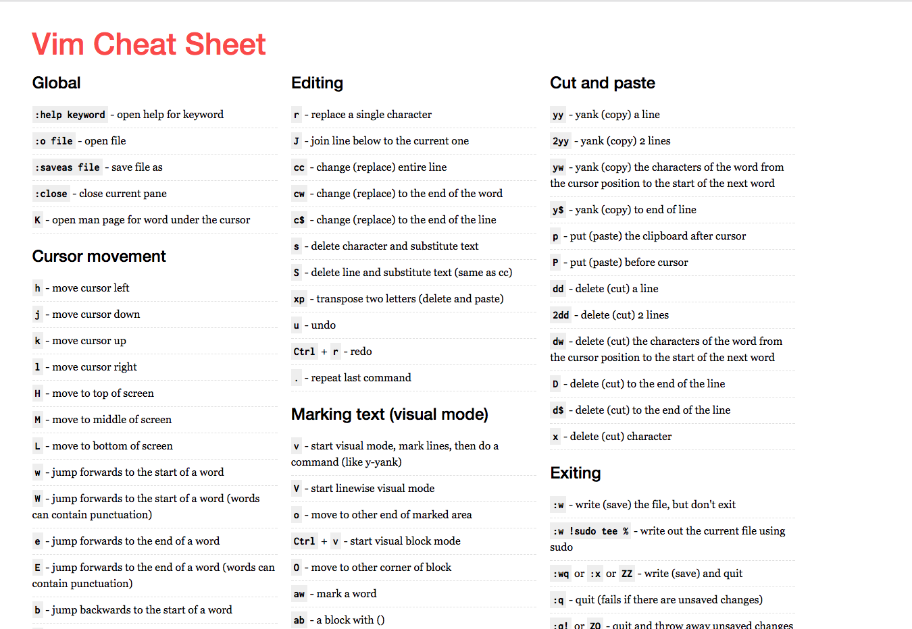
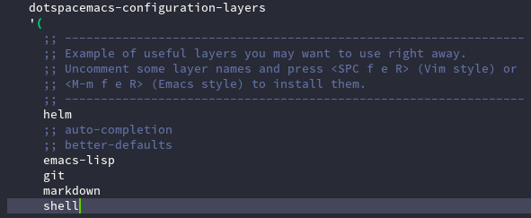
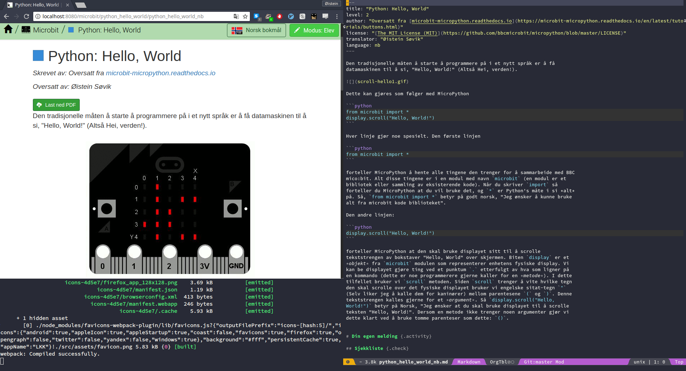
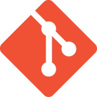
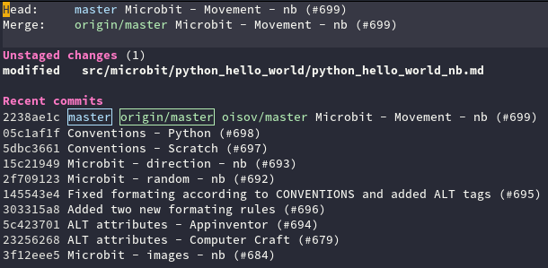

<h1 align="center" > [S P A C E M A C S] </h1>

Hurtiginstallasjon

    $ git clone https://github.com/syl20bnr/spacemacs ~/.emacs.d

# Hvorfor Spacemacs?

Det finnes noen teksteditorer som du bruker i månedvis, og det finnes andre som
du varer livet ut. Spacemacs havnet lett i den siste kategorien. I mange tiår
har det herjet en krig mellom de to kraftigste teksteditorene på unix
platformen: *emacs* og *vim*.

* *Emacs:* har blitt applaudert for et fantastisk rammeverk, og ofte blitt
  spøkfullt omtalt som et kraftig operativsystem med en svak tekstbehandler. Med
  andre ord enten du ønsker å skrive kode, bruke terminalen, lese epost eller
  chatte er dette alle ting som kan gjøres uten å forlate emacs. Ett problem
  emacs dog har hatt er forferdelige tastekombinasjoner som har vært vanskelige
  å huske, og som alle starter med `ctrl`. Slik at mange utvikler
  "emacs-lillefingeren" som stikker litt ut til siden, da du alltid holder inne*
  kontroll.

* *Vim:* Er bygget på `Vi` og stikk motsatt av emacs. Ingenting er installert
  fra starten og all funksjonalitet du vil ha må du installere selv. Det mest
  fantastiske med vim er ikke denne valgfriheten men tastekombinasjonenene.
  Etter jeg har lært meg disse er det ikke en underdrivelse at jeg skriver kode
  dobbelt så fort som før.

  En annen fordel er at alle unix operativsystem kommer med vim innebygget og
  kan kjøres direkte fra terminalen med

      vim

Et problem jeg hadde med Vim var at jeg hele tiden satt og endret på
instillingene, endret på installerte pakker også videre i stedet for å skrive
kode. Mens Emacs sliter med de elendige tastekombinasjonene og at programmet
virker veldig uoverkommelig siden det favner så bredt.

_Spacemacs tar sikte på å kombinere det beste fra emacs og vim til en_

## Fordeler

* **Flott dokumentasjon:** Lurer du på hvordan du åpner ett nytt vindu? Bare
  skriv `SPC ?` også kan du søke igjennom alle hurtigtastene. Dokumentasjonen
  ligger og tilgjengelig fra `SPC h SPC` (help).  
* **Vakker GUI:** Siden alt går på hurtigtaster er det ingen distraherende menyer,
  men bare en  informasjonslinje nederst.  
* **Ergonomisk:** Alle hurtigtaster begynner med `SPC`.  
* **Enkle å huske hurtigtaster:** I motsetning til mange andre teksteditorer har
  Spacemacs hurtigtaster som er enkle å huske. `SPC w` for
* ulike innstillinger for vinduer, `SPC p` for å søke i prosjektet, eller `SPC f
  r` for å søke igjennom **f**iles  **r**ecently visited er noen eksempler.
* **Batterier er inkludert:** I motsetning til i Vim for en installerer pakker hver
  for seg, så har Spacemacs sammlet disse i konfigurasjonslag. Slik at om du f.eks
  ønsker å Git, er det bare å legge til dette laget.
* **Kan brukes til alt:** Med innebygget støtte for nesten alle
  programmeringsspråk, inkludert LaTeX, en terminal og Git støtte trenger man
  ikke lengre bytte mellom 3-4 programmer konstant.

En advarsel før vi går videre er at tastekombinasjonenene fra Vim gjerne tar en
uke å lære, mens et liv å mestre. En annen advarsel er at når disse
tastekombinasjonene sitter vil du aldri bytte tilbake.

Merk før du fortsetter at Spacemacs er ikke spesielt nybegynnervennlig, slik at
før du fortsetter bør du i det minste være godt kjent med å bruke terminalen.
Har du problemer med installasjonen anbefales det å lese den nøyere forklaringen
på [Spacemacs Github](https://github.com/syl20bnr/spacemacs).

# Forutsetninger

Det første steget blir å installere er å installere *Emacs*, da *Spacemacs*
*egentlig* bare er et skall utenpå emacs med svært robuste konfigurasjoner

## Linux

I de aller fleste distroer ligger `emacs` allerede inne, f.eks i **Ubuntu:**

    $ sudo apt-get install emacs

## macOS

Den anbefalte måten å installere `emacs` på er via [homebrew](http://brew.sh/)

    $ brew tap d12frosted/emacs-plus
    $ brew install emacs-plus
    $ brew linkapps emacs-plus

## Windows

Emacs på Windows er enda litt mer obskurt, men du kan laste ned gode utgaver fra
[emacs-264 prosjektet](http://emacsbinw64.sourceforge.net/). Det anbefales å
installere den nyeste [stabile
utgaven](https://sourceforge.net/projects/emacsbinw64/files/release/).

# installasjon

1. Dersom du har installert Emacs fra før husk og ta kopi av instillingene dine
   før installasjon, da Spacemacs overskrider alle disse

       cd ~
       mv .emacs.d .emacs.d.bak
       mv .emacs .emacs.bak

  Alternativt dersom du ikke har brukt emacs fra før kan du trygt fjerne mappen
  `~/.emacs` slik at spacemacs kan bruke denne mappen.

       rm -rf ~/.emacs

  Merk at du bør være svært forsiktig med å bruke kommandoen ovenfor til vanlig.

2. Kopier så installasjonsfilene til spacemacs

       git clone https://github.com/syl20bnr/spacemacs ~/.emacs.d

3. Start Emacs, her vil Spacemacs installere alle de nødvendige filene som
   trengs.

Når du starter Emacs anbefaler jeg å velge full HELM støtte, samt å bruke VIM
sine hurtigtaster.

# Lære seg Spacemacs

## Vim

Hele poenget med hurtigtastene til vim er at de skal være enkle huske, samt å
gjøre at en kan bevege seg rundt i teksten mye mer effektivt. Ulempen er at
læringskurven i starten er svært høy. Heldigvis kommer Spacemacs med en
innebygget vim tutorial som kan kjøres via `SPC h T`. Denne lærer deg de
grunnleggende hurtigtastene, samt hvordan navigere seg rundt, og anbefales på
det sterkeste.

    ===============================================================================
    =       W e l c o m e   t o   t h e   E m a c s   E v i l   T u t o r         =
    =                                                                             =
    =                                    * * *                                    =
    =                                                                             =
    =                                 Version 1.0                                 =
    ===============================================================================

Andre ressurser er [OpenVim](https://www.openvim.com/tutorial.html). Videoserien
[The Basics of Vim](https://vimeo.com/album/2838732) til [Derek
Wyatt](https://vimeo.com/user1690209) er og svært solid. Her ville jeg nok sett
introduksjonen til ulike modes, samt introduksjonen til grunnlegende bevegelser.

Under følger et lite jukseark det kan være greit å ha på pulten de første dagene.

## Git og Markdown

Nå trenger vi å legge til støtte for Git og Markdown, men dette er heldigvis en
smertefri prossess. Instillingene til Spacemacs er lagret i noe som kalles for
en dotfil, og åpnes med

    SPC f e d

Huskeregelen er **f**ile **e**macs **d**otfile. Deretter kan vi legge til
`markdown`, `git` og `shell` til konfigurasjonslagene våre

Dette er bare en sammling av mindre nyttige pakker. Så må vi lagre endringene,
enten ved å bruke `:w RET` (Hvor `RET` er forkortelsen for Return), eller `SPC f
s` (**f**ile **s**ave).

Tilslutt må vi starte Spacemacs på nytt for å bruke de nye innstillingene `SPC q R`.

## Markdown

I utgangspunktet så støtter Spacemacs å forhåndsvisning av Markdown filer med å
bruke  `SPC m c p`. Er du allerede på nivået hvor du bruker Spacemacs er det nok
langt mer naturlig å sette opp en lokal server og bygge kodeklubbens nettsider
derfra. Se introduksjonen til Git hvordan du gjør dette

Her er et bilde av at jeg arbeider med en ny oppgave i Spacemacs. Til venstre så
vises den lokale versjonen av kodeklubbens nettsider i Chrome, mens nede venstre
hjørnet så kjøres serveren fra en terminal.

For å se alt du kan gjøre med Markdown laget kan du titte på [dokumentasjonen på
Git](https://github.com/syl20bnr/spacemacs/tree/master/layers/%2Blang/markdown).

## Git

Noe av det mest fantastiske med å bruke Spacemacs er integrasjonen med Git. Konfigurasjonslaget
`git` inneholder bla pakken [magit](https://magit.vc/about/) som hevder å forbedre git på nesten alle plan. Det enkleste måten å bruke Git laget på er ved å åpne menyen med

    SPC g m

(**g**it **m**enu).

Fra denne menyen kan en gjøre alt en trenger med git. Noen av de mest nyttige kommandoene er listet under

| Key Binding | Description                                                          |
| :----------- |:--------------------------------------------------------------------|
| `c c`       | åpne en =commit message buffer=                                      |
| `b b`       | checkout en branch                                                   |
| `b c`      | opprett en branch                                                    |
| `f f`       | hent hendringer fra remote (fetch)                                   |
| `P u`       | push til gjeldende branch                                            |
| `P m`       | push til matchende branch (e.g., upstream/develop to origin/develop) |
| `q`         | Avslutt                                                              |
| `s`         | Stage fil eller del av fil                                           |
| `x`         | vrak endringer (discard changes)                                     |
| `S`         | stage alle filene                                                    |
| `TAB`       | på en fil: utvid/trekk sammen diff                                   |
| `u`         | på en staged fil: unstage                                            |
| `U`         | unstage alle staged filer                                            |
| `z z`       | stash endringer                                                      |

**Commit:** Etter du har ånet en commit fane `c c` og skrevet en melding kan du
commite denne meldingen med `,c` (**c**ommit) (dersom
`dotspacemacs-major-mode-leader-key` er ​,​) eller `ctrl c ctrl c`. Om du
ombestemmer deg kan du og unngå å commite med å bruke `,a` (**a**bort).

For å se alt du kan gjøre med Git laget kan du titte på [dokumentasjonen på
Git](https://github.com/syl20bnr/spacemacs/tree/master/layers/%2Bsource-control/git).

# Ekstra

## Temaer

For å endre utseende kan en legge til nye temaer i dotfila `SPC f d` slik ser
min ut

    dotspacemacs-themes '(dracula
                          spacemacs-dark
                          spacemacs-light)

Andre populære alternativer er `solarized-dark`, `solarized-light` og `monokai`.
Du kan og få mange, mange flere temaer ved å følge fremmgangsmåten under:

* Start emacs
* Åpne Spacemacs konfigurasjonsfila `SPC f e d` (file edit dotfile)
* Oppdater `dotspacemacs-configuration-layer` med å legge til `themes-megapack`
* Oppdater konfigurasjonsfila  `SPC f e R`
* Oppdater `dotspacemacs/user-init` ved å legge til `dotspacemacs-themes '(jbeans)))`
, hvor du erstatter **jbeans** med temaet du ønsker fra [listen](http://themegallery.robdor.com/)
* Restart Spacemacs for å bruke det nye temaet `Spc q R`

Du kan se ulike temaer som er tilgjengelig fra
[galleriet](http://themegallery.robdor.com/)

## Nyttige pakker

Av ekstra pakker bruker jeg selv veldig få, men to jeg må ha er `evil-surround`
og `evil-replace-with-register`. For å legge til disse må en legge disse til i
`dotspacemacs-additional-packages` som vist under.

    ;; configuration in `dotspacemacs/user-config'.
    dotspacemacs-additional-packages '(evil-replace-with-register evil-surround)

I tillegg trenger vi noen små endringer under `(defun dotspacemacs/user-config
()`.

    (require 'evil-replace-with-register)
    ;; change default key bindings (if you want) HERE
    (setq evil-replace-with-register-key (kbd "gr"))
    (evil-replace-with-register-install)

    (use-package evil-surround
      :ensure t
      :config
      (global-evil-surround-mode 1))

[Index](#index)

